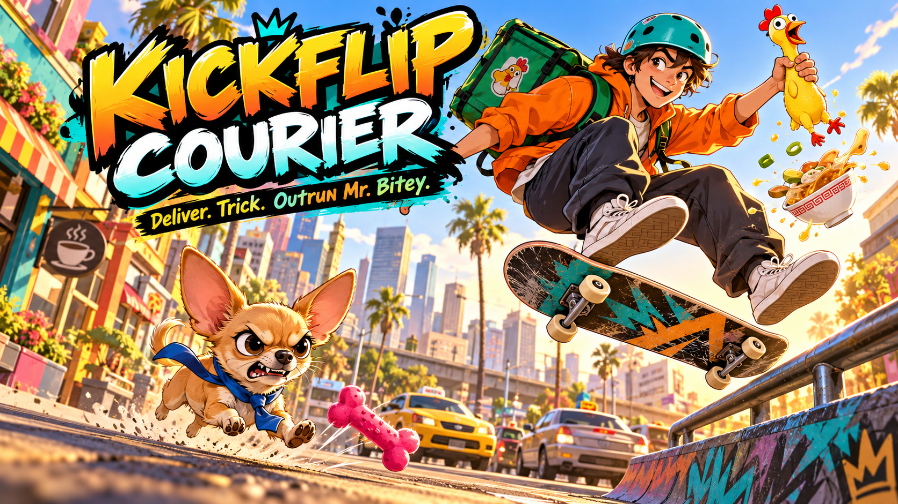

# Kickflip Courier

[Play the game](https://kickflip-courier.jordanw1989.chatgpt.site/)



Deliver ridiculous cargo, land skateboard tricks, and outrun Mr. Bitey—the tiny Chihuahua who wants your job. An original single-player browser arcade game for phones and laptops. No login or installation required.

## Play

Start a 60-second shift. Deliveries add time; car collisions end your run. Choose safer scenic streets or shortcuts with 50% extra delivery pay. Collect cash from tricks, grinds, near misses, delivery streaks, and perfectly timed throws. Soup and cake lose value after wipeouts.

Bitey can chase you or steal your package. Boost after him to recover stolen cargo. Collect squeaky toys or refill your bag in the skate shop; carry up to three. Your earnings, cosmetic purchases, unused toys, and personal bests save in this browser.

### Phone

- Hold the road to boost; lift your finger to slow down.
- Swipe left/right to steer, or up to jump while holding.
- Use Throw for deliveries and the small toy arrows to distract Bitey.
- Buttons remain available for steering, boost, and tricks.

### Keyboard

- Arrow keys / A and D: steer.
- Up / W / Shift: boost. Down / S: brake.
- Space: jump or trick.
- E: throw or deliver.
- Q / R: toss a toy left / right.
- Escape: pause.

## Run locally

Serve this folder with any static web server. For example, with Python 3:

```sh
python3 -m http.server 8000
```

Open http://localhost:8000. No build step or package installation is required.

## Checks

With Node.js installed:

```sh
node test-engine.mjs
```

The simulation checks cover deliveries, PvE hazards, car collision endings, rail grinding, tricks, route rewards, toy inventory and distractions, cargo damage, theft recovery, streak bonuses, and mobile boost input.

## Project files

- `engine.js`: gameplay simulation.
- `game.js`: canvas rendering, UI, controls, audio, and browser saves.
- `index.html` and `style.css`: responsive game interface.
- `dog.png`: original generated Chihuahua art used in the game.
- `cover.png`: promotional illustration created with OpenAI image generation; it is cover art rather than a gameplay screenshot.

Built with HTML, CSS, JavaScript, Canvas, and Web Audio, with OpenAI assistance. Published separately using Sites. This repository contains the portable game source and public assets; local hosting credentials and deployment configuration are excluded.
